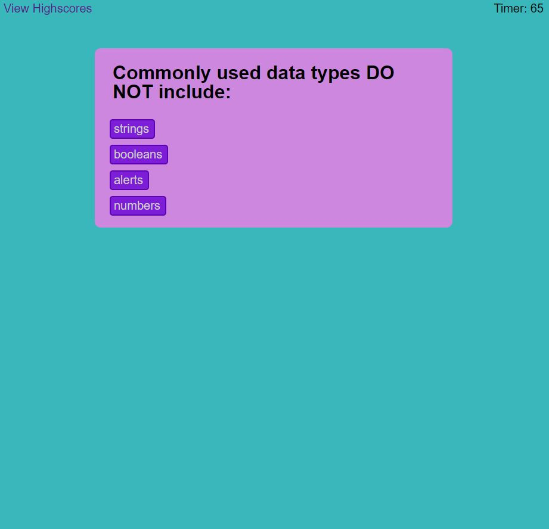

# Coding Quiz
A user provided they wanted a intuitive coding quiz that met the following criteria:

* Button click password generator
* Prompts to ask for certain password criteria, ex. Number, Special Characters, Letters(Upper/Lowercase)
* Prompt for the password length between 8 and 128 characters
* Validate password to make sure it has all criteria selected. 
* Password generated will be randomized. 

## Coding Quiz

[Check it out here!](https://mcstewart76.github.io/CodingQuiz/)

>**Picture of the site**

